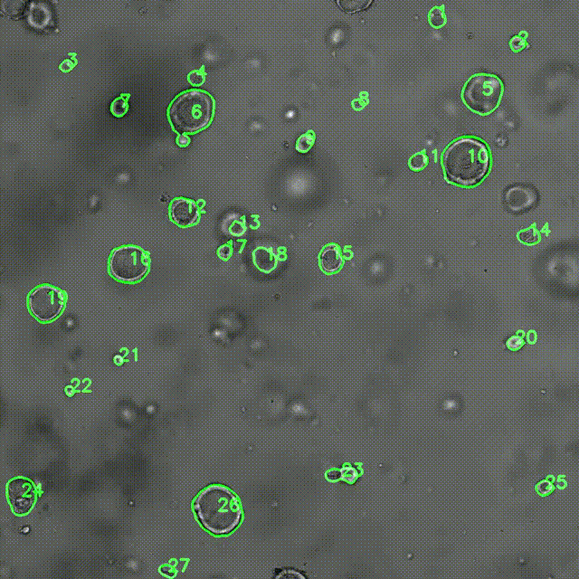
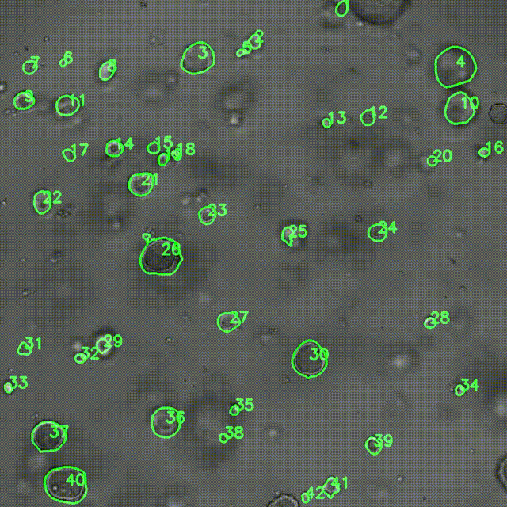
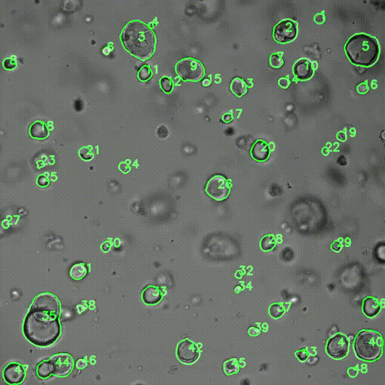
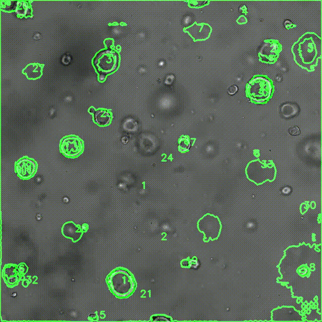
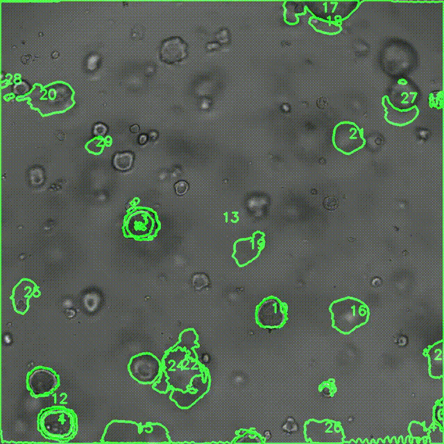
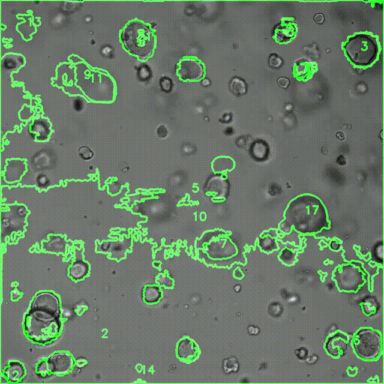
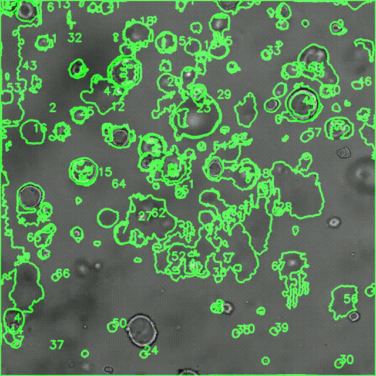
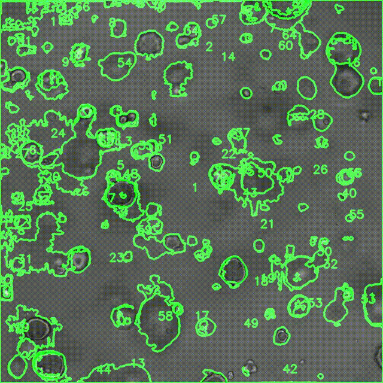
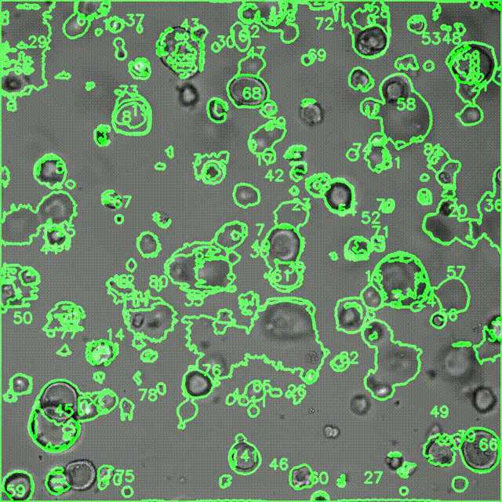

# 🧑‍🔬🔬🦠 TransOrga-plus: A Knowledge-driven Deep Learning Framework for Organoid Morphological Segmentation and Characterisation

Organoids have great potential to revolutionize various aspects of biomedical research and healthcare. Researchers typically use the fluorescence-based approach to analyze their dynamics, which requires specialized equipment and may interfere with their growth. Therefore, it is an open challenge to develop a general framework to analyze organoid dynamics under non-invasive and low-resource settings. In this paper, we present a knowledge-driven deep learning system named TransOrga-plus to automatically analyze organoid dynamics in a non-invasive manner.

Given a bright-field microscopic image, TransOrga-plus detects organoids through a multi-modal transformer-based segmentation module. To provide customized organoid analysis, a biological knowledge-driven branch is embedded into the segmentation module which integrates biological knowledge, e.g., the morphological characteristics of organoids, into the analysis process. Then, based on the detection results, a lightweight multi-object tracking module based on the decoupling of visual and identity features is introduced to track organoids over time. Finally, TransOrga-plus outputs the dynamics analysis to assist biologists for further research.

To train and validate our framework, we curate a large-scale organoid dataset encompassing diverse tissue types and various microscopic imaging settings. Extensive experimental results demonstrate that our method outperforms all baselines in organoid analysis. %Moreover, we invited a group of biologists to further evaluate the effectiveness of TransOrga-plus through a real-world study. 

The results show that TransOrga-plus provides better analytical results and significantly accelerates their work process. In conclusion, TransOrga-plus enables the non-invasive analysis of various organoids from complex, low-resource, and time-lapse situations.

## Requirements
This software is compatible with a Linux operating system, specifically Ubuntu 20.04 (compatibility with other versions has not been tested), and requires Python 3.9. It necessitates 64GB of RAM and 1TB of disk storage. Performance benchmarks are based on an Intel(R) Core(TM) i9-10900K CPU @ 3.70GHz and an NVIDIA 3090 GPU.
### How to use TransOrga-plus 
#### Step 1: Prerequisties

1. Open the terminal, or press Ctrl+Alt+F1 to access the command line interface.

2. Clone this repository to your home directory.

    ```
    git clone https://github.com/dev-csftan/TransOrga.git
    ```

3. Navigate to the cloned repository's directory.
    ```
    cd TransOrga
    ```


#### Step 2: Prepare the environment
1. Install the required Python packages.

    ```
    python3 -m pip install --user -r requirements.txt
    ```
2. Install the DeAOT and download the pretrained models [here](https://github.com/chen-si-jia/DeAOT).
    *** You can also find the descriptions of DeAOT in
    ```
    TransOrga-plus/aot/README.md
    ```


#### Step 2: Train the model
1. Prepare the dataset, you can download the public dataset [here](https://osf.io/xmes4/)
2. Please unzip these files and place the folders in the root directory, like 

    `TransOrga-plus/Dataset`,
    
    Please first obtain the frequency-level images using **[SRNET.py](SRNet.py)**, and put these images under `TransOrga-plus/SR_results`.
    
    *** Note that: The frequency-level images of https://osf.io/xmes4/ is [SR_result](https://drive.google.com/file/d/1F0eUE39K6k09U5Ib7aHPvmsgOzLD-U5_/view?usp=sharing) and the edge images is [edge](https://drive.google.com/file/d/1DJslK0MAXTmoflxycCBbMOZKXjpCqMJc/view?usp=sharing).

3. Download the official pretrained vit-base model [here](https://drive.google.com/file/d/11UcqfiWLkDjOlUf2bQ17KKusi93lPXhn/view?usp=sharing).

4. Download the pretrinaed models [here](https://drive.google.com/drive/folders/1VzHqXmPPgQHFGAQc2a3H8XnC04fjOV12?usp=sharing) and save them in `TransOrga-plus/ckpt` folder.


5. Run `train.py`

    ```
    python train.py
    ```

6. Save the checkpoints under `TransOrga-plus/log/checkpoint`

<h3>Step 3: Inference</h3>

1. Run `test.py` to obtain the interactive segmentation results.

    ```
    python test.py
    ```

2. Run `main.py` to obtain the final results of organoid dynamics.

    ```
    python main.py
    ```

    You can change the "input_path" as your file path, the "output_video" as the output video path and the "output_gif" as the output gif path.


# Demo of TransOrga-plus
Here are some video results of TransOrga-plus under different organoid situations.
<table>
  <tr>
      <td style="vertical-align: top; text-align: left;">
      <strong>Transorga-plus:</strong><br>
    </td>
    <td style="text-align: center;">
      
    </td>
    <td style="text-align: center;">
      
    </td>
    <td style="text-align: center;">
      
    </td>
    
  </tr>
</table>
<table>
  <tr>
      <td style="vertical-align: top; text-align: left;">
      <strong>Fine-tuned STA:</strong><br>
    </td>
    <td style="text-align: center;">
      
    </td>
    <td style="text-align: center;">
      
    </td>
    <td style="text-align: center;">
      
    </td>
    
  </tr>
</table>
<table>
  <tr>
      <td style="vertical-align: top; text-align: left;">
      <strong>STA:</strong><br>
    </td>
    <td style="text-align: center;">
      
    </td>
    <td style="text-align: center;">
      
    </td>
    <td style="text-align: center;">
      
    </td>
    
  </tr>
</table>
